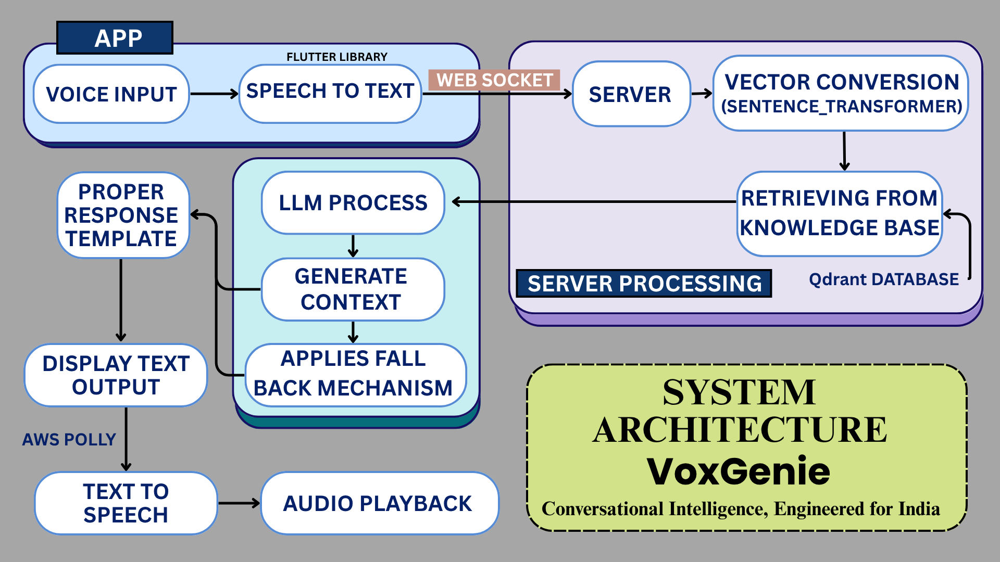

# VoxGenie - Conversational AI Platform for P2P Lending

## Overview

VoxGenie is an enterprise-grade conversational AI platform purpose-built for India's P2P lending sector, designed to bridge the gap between complex financial products and millions of underserved users through emotionally intelligent voice interactions. Our Flutter-based application enables financial institutions to deliver human-like, multilingual conversations—automating lead validation, borrower education, onboarding, and support with empathy and precision.

In 2024, India's P2P lending sector surpassed ₹16,000 crore in disbursements, yet platforms faced rising defaults and saw over 80% of new user inquiries abandoned due to long wait times and complex onboarding. VoxGenie addresses these critical challenges by streamlining user education, automating onboarding, and significantly improving customer experience.

## Key Features

1. **Multimodal Input Flexibility**: Seamlessly switch between voice and text inputs, with intelligent context retention and smooth transitions.

2. **Comprehensive Conversation Memory**: Maintains complete, timestamped conversation history across sessions, enabling easy reference to previous interactions.

3. **Emotion, Intent & Domain-Aware Routing**: Detects tone, emotion, and multi-intent queries in real time for accurate, empathetic responses.

4. **Multilingual & Code-Mixed Support**: Handles Hindi, Marathi, English, and mixed-language queries with confidence indicators and editable transcriptions.

5. **Natural Voice Response**: Delivers human-like, adjustable voice interactions using AWS Bedrock and local TTS options.

6. **Real-Time Architecture**: Employs low-latency socket communication, scalable microservices, and analytics-driven improvements.

## System Architecture



## Environment Setup

### Prerequisites

- Python 3.9+
- pip package manager
- Flutter SDK (for mobile app)
- AWS account with Bedrock access (for production)
- Qdrant vector database instance

### Installation

1. Clone the repository:
   ```
   git clone https://github.com/kshitij-dmce/voicebot_SHILEDAR_submission.git
   cd voicebot_SHILEDAR_submission
   ```

2. Install Python dependencies:
   ```
   pip install -r requirements.txt
   ```

3. Create a `.env` file in the root directory with your API keys:
   ```
   GEMINI_API_KEY = "your-gemini-key"
   QRDANT_API_KEY = "your-qdrant-key"
   QRDANT_URL = "your-qdrant-url"
   AWS_ACCESS_KEY = "your-aws-access-key"
   AWS_SECRET_KEY = "your-aws-secret-key"
   ```

4. Download NLTK resources (automatically handled during first run, but can be done manually):
   ```
   python -c "import nltk; nltk.download('punkt')"
   ```

## Running the Inference Script (Round 1)

The `run_inference.py` script processes test questions from a CSV file and generates AI responses:

1. Create an input CSV file with questions (default name: test_questions.csv)
2. Run the inference script:
   ```
   python run_inference.py
   ```

3. The script will:
   - Load questions from the input CSV
   - Process each question using our RAG pipeline
   - Generate responses using advanced LLMs
   - Save results to an output CSV (default: inference_output.csv)

You can customize the behavior by editing the configuration variables at the top of the script.

## Running the Live Demo

To run the complete VoxGenie demo with voice interface:

1. Start the backend server:
   ```
   python main.py
   ```
   This will start the Flask server with Socket.IO on port 7000.

2. For the Flutter mobile app (optional):
   ```
   cd frontend
   flutter run
   ```

The server provides a WebSocket API for real-time voice and text processing. It connects to:
- A Qdrant vector database for knowledge retrieval
- AWS Bedrock for high-quality response generation
- A sentiment analysis model for emotion detection

## Environment Variables

The following environment variables must be set in your `.env` file:

```
GEMINI_API_KEY = "Your Google Gemini API key"
QRDANT_API_KEY = "Your Qdrant API key"
QRDANT_URL = "Your Qdrant collection URL"
AWS_ACCESS_KEY = "Your AWS access key"
AWS_SECRET_KEY = "Your AWS secret key"
```

## API Endpoints

- **Socket.IO**: `ws://localhost:7000/`
  - Event: `user_query` - Send a user question
  - Event: `bot_response` - Receive AI response

## Future Development

- Expansion of multilingual capabilities
- Integration with additional banking systems
- Enhanced fraud detection modules
- Advanced analytics dashboard

## License

© 2025 Team SHILEDAR. All rights reserved.

---

**Note**: This project was developed for the Matrix Protocol AI Hackathon and demonstrates the potential of conversational AI in revolutionizing P2P lending in India.
